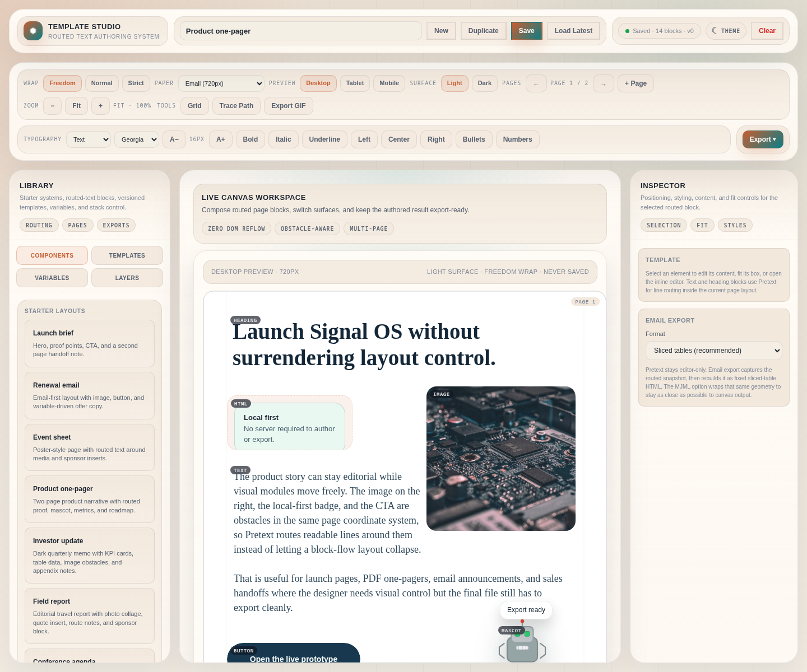
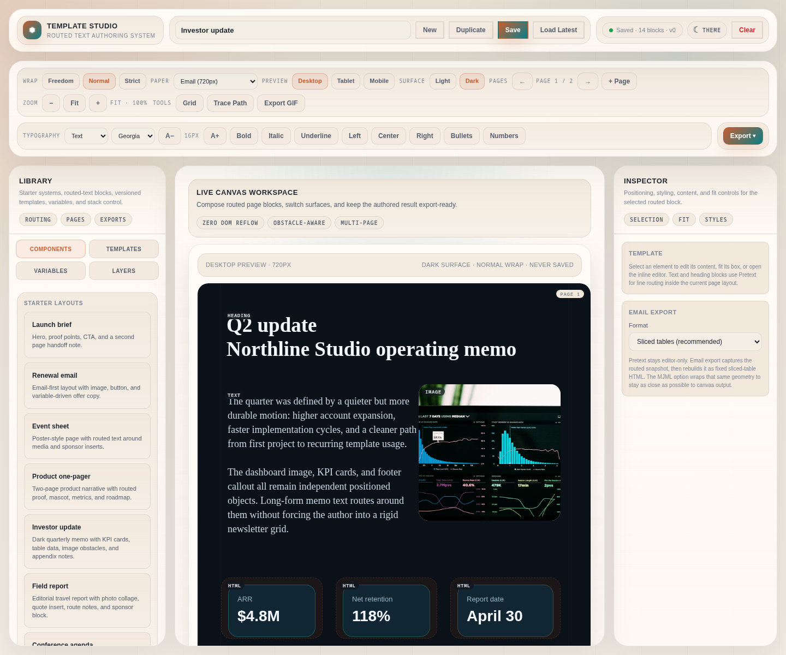
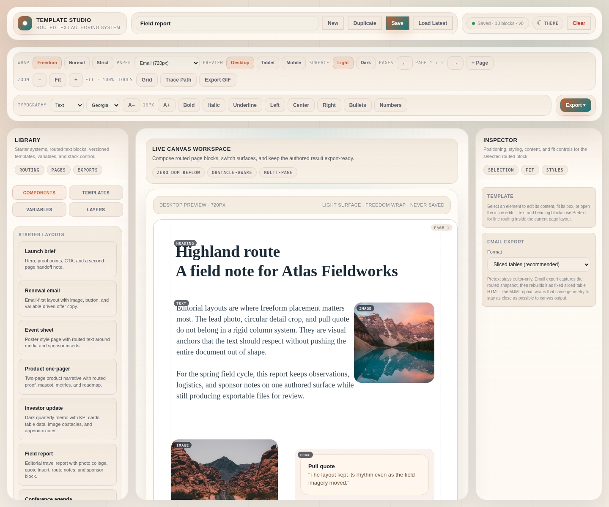
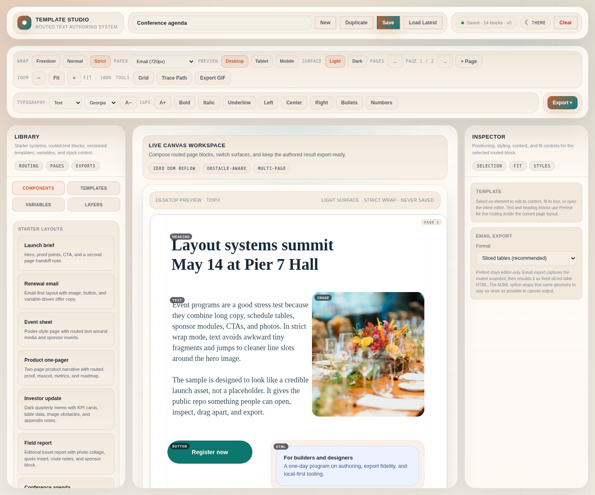

# Pretext Template Studio

A local-first visual editor for designed documents, landing pages, and email templates. It uses [Pretext](https://www.npmjs.com/package/@chenglou/pretext) to route text around freely positioned objects, so images, buttons, tables, HTML blocks, and animated media can move without collapsing the rest of the layout.

The project is intentionally usable offline. The editor runs in the browser, stores work in `localStorage`, and exports files locally. Optional network features, such as a test-email proxy, are kept outside the core editing flow.

## Screenshots

| Product one-pager | Investor update |
| --- | --- |
|  |  |

| Field report | Conference agenda |
| --- | --- |
|  |  |

## Why It Exists

Most page and email builders are block-flow systems. They work well while you stay inside rows, columns, sections, and client-safe tables, but they become fragile when you try to place media freely. Moving one image can trigger a cascade of layout changes.

Pretext Template Studio uses a geometry-first model instead:

- Elements have explicit `x`, `y`, `width`, and `height` geometry.
- Media and components are treated as obstacles, not layout parents.
- Text is projected into available line slots around those obstacles.
- Exports reuse the resolved layout instead of asking browser flow to rediscover it.

That is the core trick: freeform placement with deterministic routed text.

## Features

- Freeform canvas editing with drag, resize, selection handles, layers, and inspector controls.
- Routed text powered by `@chenglou/pretext`, including obstacle-aware line placement.
- Multi-page documents with paper presets and responsive preview widths.
- Variables for reusable template content.
- Rich element library: text, headings, images, CTAs, HTML snippets, tables, animated visuals, and mascot media.
- Animated visual uploads support GIF, SVG, embedded-SVG JSON, and common Lottie/bodymovin JSON as SVG poster frames.
- Mascots can follow inspector waypoints or hand-drawn walking paths on the canvas.
- Local persistence with document backups and saved templates.
- Export pipelines for HTML, email HTML/MJML-style table output, plain-text email, PDF, DOCX, JSON, and GIF.
- Optional SparkPost test-email proxy for development.

## Quick Start

```bash
bun install
bun start
```

Open:

```text
http://localhost:3000/
```

Use another port when `3000` is busy:

```bash
bunx vite --host 0.0.0.0 --port 3002 --strictPort
```

## Sample Templates

The studio ships with richer sample documents for screenshots, demos, and export testing:

- `product-one-pager`: launch narrative with routed proof, mascot, metrics, and roadmap.
- `investor-update`: dark quarterly memo with KPI cards, image obstacles, and appendix table.
- `field-report`: editorial report with photo collage, pull quote, itinerary, and sponsor block.
- `conference-agenda`: program sheet with schedule table, media, sponsor cards, and CTA.

Open a sample directly:

```text
http://localhost:3000/?preset=product-one-pager
```

Screenshot captures live in [samples/screenshots](./samples/screenshots), with capture commands in [samples/README.md](./samples/README.md).

## Verification

```bash
bun run check
bun run test
bun run build
```

Or run the full local gate:

```bash
bun run verify
```

## Open-Source Status

This repository is being prepared as a serious open-source codebase. The editor is already usable locally, but the public contract is still intentionally conservative:

- The local-first browser app is the supported entry point.
- Export fidelity is a core quality bar, not a best-effort extra.
- The large `src/app-controller.ts` module is a transitional compatibility layer; new behavior should live in focused modules with tests.
- Public examples should stay runnable without service credentials.
- Optional services, such as the SparkPost test-email proxy, must stay outside the default editing path.

Good first areas for contributors are text-layout fixtures, export regression tests, sample templates, accessibility improvements, and focused extractions from `src/app-controller.ts`.

## Project Layout

```text
.
├── index.html
├── src/
│   ├── main.ts
│   ├── app-controller.ts
│   ├── store.ts
│   ├── render-loop.ts
│   ├── text-projection.ts
│   ├── wrap-geometry.ts
│   ├── export-assembly.ts
│   └── ...
├── docs/
│   ├── ARCHITECTURE.md
│   ├── TEXT_LAYOUT_GUIDE.md
│   ├── EXPORT_PIPELINES.md
│   ├── MODULE_INDEX.md
│   ├── OPEN_SOURCE.md
│   ├── LAUNCH.md
│   └── ROADMAP.md
├── .github/
│   ├── workflows/ci.yml
│   ├── ISSUE_TEMPLATE/
│   └── pull_request_template.md
├── CONTRIBUTING.md
├── CHANGELOG.md
├── SECURITY.md
├── LICENSE
├── package.json
└── tsconfig.json
```

## Important Modules

- `src/text-projection.ts`: bridge from editor elements to Pretext layout APIs.
- `src/store.ts`: synchronous app store for document, interaction, runtime, and animation state.
- `src/render-loop.ts`: requestAnimationFrame scheduling driven by store changes.
- `src/app-controller.ts`: compatibility controller while feature modules move off legacy hooks.
- `src/browser-download.ts`: browser download side effects used by export actions.
- `src/wrap-geometry.ts`: computes available line intervals around obstacles.
- `src/canvas-interactions.ts`: pointer selection, dragging, resizing, and canvas manipulation.
- `src/properties-panel.ts`: inspector UI for selected elements.
- `src/vector-json.ts`: SVG/Lottie JSON importer for portable animated visual uploads.
- `src/export-assembly.ts`: central export dispatcher.
- `src/email-export.ts` and `src/snapshot-to-mjml.ts`: email-compatible output.
- `src/pdf-export.ts`, `src/docx-export.ts`, `src/html-export.ts`, `src/gif-exporter.ts`: format-specific exports.

## Optional Test Email Proxy

The editor is fully local by default. To test sending generated email output during development, create `.env.local` with:

```bash
SPARKPOST_API=your_key_here
```

Then run:

```bash
bun run email:proxy
```

The proxy listens on `http://localhost:3001` and is intended for local development only.

## Documentation

- [Architecture](./docs/ARCHITECTURE.md)
- [Text layout guide](./docs/TEXT_LAYOUT_GUIDE.md)
- [Export pipelines](./docs/EXPORT_PIPELINES.md)
- [Module index](./docs/MODULE_INDEX.md)
- [Open-source readiness guide](./docs/OPEN_SOURCE.md)
- [Launch notes](./docs/LAUNCH.md)
- [Roadmap](./docs/ROADMAP.md)
- [Contributing](./CONTRIBUTING.md)
- [Security policy](./SECURITY.md)
- [Changelog](./CHANGELOG.md)

## License

MIT. See [LICENSE](./LICENSE).
